# 16-bit CPU — Project Documentation

A complete 16-bit CPU designed in **Logisim Evolution**, featuring an integrated GPU, an advanced ALU with a hardware multiplier and Carry-Lookahead Adder (CLA), and keyboard + RGB display I/O support.

The project is split across three `.circ` files:

| File | Main contents |
|---|---|
| `AMFB-16.circ` | Full ALU (add, subtract, logic, shifts, multiplication, popcount) |
| `CMFB-16.circ` | Full CPU (PC, registers, decoder, adapted ALU) |
| `GMFB.circ` | Complete system with GPU, GCPU and I/O registers |

---

## Overall Architecture

```
┌─────────────────────────────────────────────────────┐
│                   FullComputer                      │
│  ┌────────────┐   ┌──────────────────────────────┐  │
│  │  Keyboard  │   │         Computer             │  │
│  └─────┬──────┘   │  ┌──────┐  ┌──────┐          │  │
│        │          │  │ ROM  │  │ RAM  │          │  │
│        └──────────┤  │ 16@64│  │ 16@16│          │  │
│                   │  └──────┘  └──────┘          │  │
│                   │  ┌───────────────────────┐   │  │
│                   │  │         CPU           │   │  │
│                   │  │  PC · Regs · Decode   │   │  │
│                   │  │  adaptedALU           │   │  │
│                   │  └───────────────────────┘   │  │
│                   │  ┌───────────────────────┐   │  │
│                   │  │         GPU           │   │  │
│                   │  │  GCPU · GALU · VRam   │   │  │
│                   │  └───────────────────────┘   │  │
│                   └──────────────────────────────┘  │
│                              │                      │
│                        RGB Video                    │
└─────────────────────────────────────────────────────┘
```

---

## Instruction Format (64 bits)

The instruction word is 64 bits wide, split into 6 fields by the decoder's main splitter:

| Bits | Width | Field | Description |
|---|---|---|---|
| 63–48 | 16 | Immediate data | Immediate value or address |
| 47–28 | 20 | Immediate data (ext.) | Upper extension of the immediate |
| 27–24 | 4 | WAddr | Destination register address |
| 23–20 | 4 | RAddrB | Source register B address |
| 19–16 | 4 | RAddrA | Source register A address |
| 15–0 | 16 | Opcode | Operation code |

<!-- SCREENSHOT: Logisim > CMFB-16.circ > decode — zoom in on the main 64-bit splitter showing the 6 output groups labelled -->
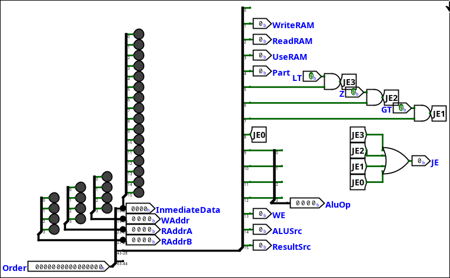

### Control signals generated by `decode`

| Signal | Width | Function |
|---|---|---|
| `WE` | 1 | Write enable to the register file |
| `ALUSrc` | 1 | Selects immediate or register as operand B |
| `ResultSrc` | 1 | Selects ALU result or RAM data as writeback value |
| `WriteRAM` | 1 | RAM write enable |
| `ReadRAM` | 1 | RAM read enable |
| `UseRAM` | 1 | Enables memory access |
| `Part` | 1 | Selects high or low byte |
| `AluOp` | 4 | ALU operation (16 possible operations) |
| `LT` | 1 | Less-Than flag (for branch instructions) |
| `Z` | 1 | Zero flag (for branch instructions) |
| `JE` | 1 | Jump if Equal |
| `GT` | 1 | Greater-Than flag |

---

## Files in Detail

---

### `CMFB-16.circ` — CPU

Contains the core processor circuits.

<!-- SCREENSHOT: Logisim > CMFB-16.circ > FullComputer — full circuit view -->
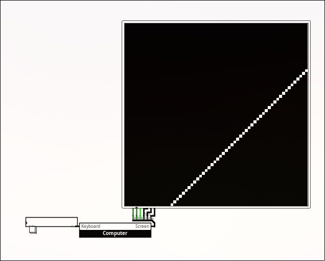

#### `FullComputer`
Top-level circuit. Instantiates `Computer`, the `Keyboard` input component, and the `RGB Video` output.

#### `Computer`
Integrates all system subsystems:
- **ROM** — 16-bit address, 64-bit instruction words
- **DualRAM** — 16-bit address, 16-bit data words
- **CPU** — main processor
- **GPU** — graphics unit (imported from `GMFB.circ`)
- Reset logic, clock distribution, and bus multiplexers

<!-- SCREENSHOT: Logisim > CMFB-16.circ > Computer — full circuit view showing ROM, RAM, CPU and GPU blocks connected -->
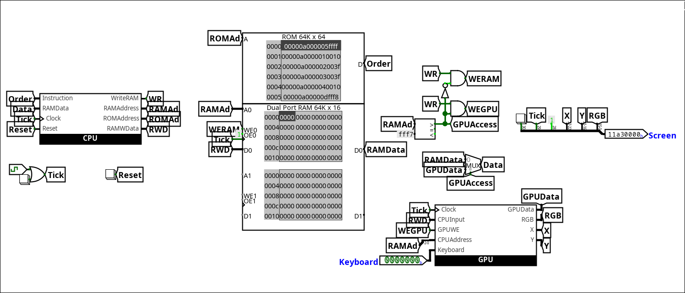

#### `CPU`
The processor core. Instantiates:

| Sub-component | Function |
|---|---|
| `programCounter` | Program counter |
| `registers` | 16-register general-purpose register file |
| `decode` | Instruction decoder |
| `adaptedALU` | Interface between CPU and ALU |

External signals: `Clock`, `Reset`, `Instruction[64]`, `WriteRAM`, `ROMAddress[16]`, `RAMAddress[16]`, `RAMWData[16]`, `RAMData[16]`.

<!-- SCREENSHOT: Logisim > CMFB-16.circ > CPU — full circuit view showing the four sub-blocks and their interconnections -->
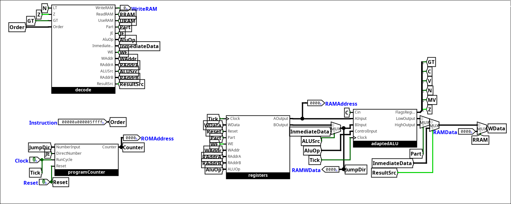

---

#### `programCounter`
16-bit program counter implemented **from gates only**, without using Logisim's built-in Counter component.

- Built from **16× `minihalfadder`** chained in series, forming a ripple incrementer
- Two `reverse` blocks handle bit-order adaptation
- A 16-bit `Register` stores the current PC value
- A 16-bit `Multiplexer` chooses between the incremented value (+1) and a direct jump address (`NumberInput`)
- `DirectNumber` selects between increment and absolute load (jump)
- `RunCycle` gates the counter advance
- `Reset` clears the PC to 0

```
NumberInput ──┐
              MUX ──► Register ──► Counter (output)
PC + 1 ───────┘
   ▲
   └── 16× minihalfadder (bit-by-bit incrementer)
```

<!-- SCREENSHOT: Logisim > CMFB-16.circ > programCounter — full circuit view highlighting the chain of 16 minihalfadders and the MUX+Register -->
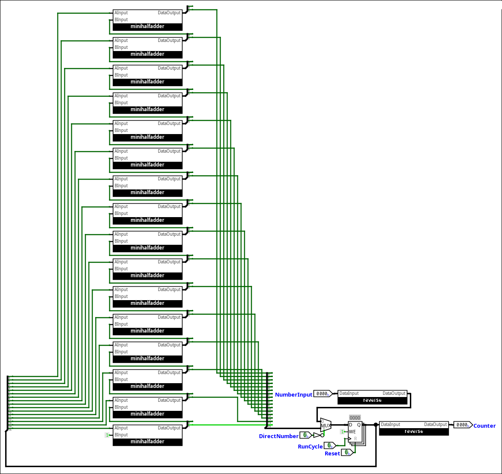

---

#### `registers`
**16-register file, 16 bits each** (17 `Register` flip-flops in total, including one auxiliary register).

- **Dual read ports**: `RAddrA[4]` and `RAddrB[4]` select operands `AOutput` and `BOutput` via multiplexers
- **Write port**: `WAddr[4]` + `WE` + a 4→16 decoder activates the target register
- `ALUOp[4]` and `Part[1]` are auxiliary signals for special operations
- `Reset` clears all registers
- `Clock` synchronises writes

<!-- SCREENSHOT: Logisim > CMFB-16.circ > registers — full circuit view showing the register array, decoder, and dual-read multiplexers -->
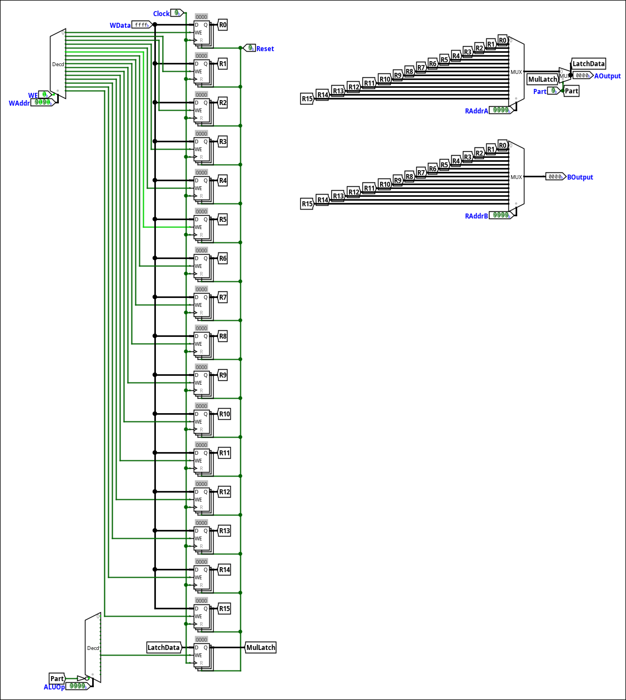

---

#### `decode`
Combinational (stateless) instruction decoder. Receives the 64-bit instruction word and generates all control signals.

- A 64→6 `Splitter` extracts the instruction fields
- Additional 4-bit splitters break out the register addresses
- 28 debug LEDs display each signal's state during simulation
- AND/OR logic combines `LT`, `Z`, `JE`, `GT` to produce branch conditions

<!-- SCREENSHOT: Logisim > CMFB-16.circ > decode — full circuit view showing the main splitter, control logic, and the 28 debug LEDs -->


---

#### `adaptedALU`
Adapter between the CPU and the ALU from `AMFB-16.circ`.

- Instantiates the full `ALU`
- A 1-bit `Register` latches the carry flag (`Cin`) across cycles
- Four `reverse` blocks handle bit-order adaptation on the interfaces
- Exposes `FlagsRegister[6]`: Zero, Carry, Overflow, Less-Than, Greater-Than, Negative

<!-- SCREENSHOT: Logisim > CMFB-16.circ > adaptedALU — full circuit view showing the ALU instance, carry register, and reverse blocks -->
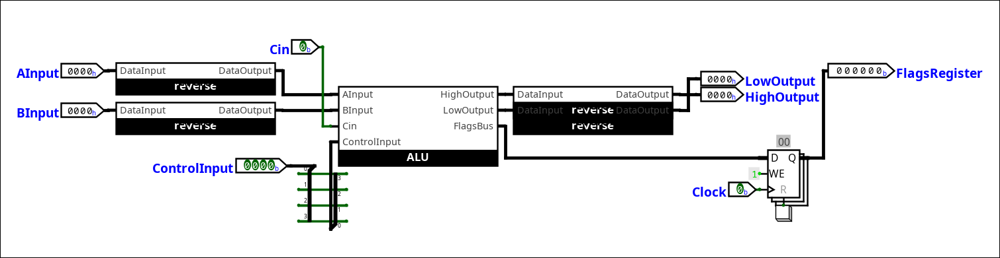

---

### `AMFB-16.circ` — ALU

Complete 16-bit Arithmetic Logic Unit with multiple functional units.

<!-- SCREENSHOT: Logisim > AMFB-16.circ > ALU — full top-level view showing the five functional units and the output multiplexer/selector -->
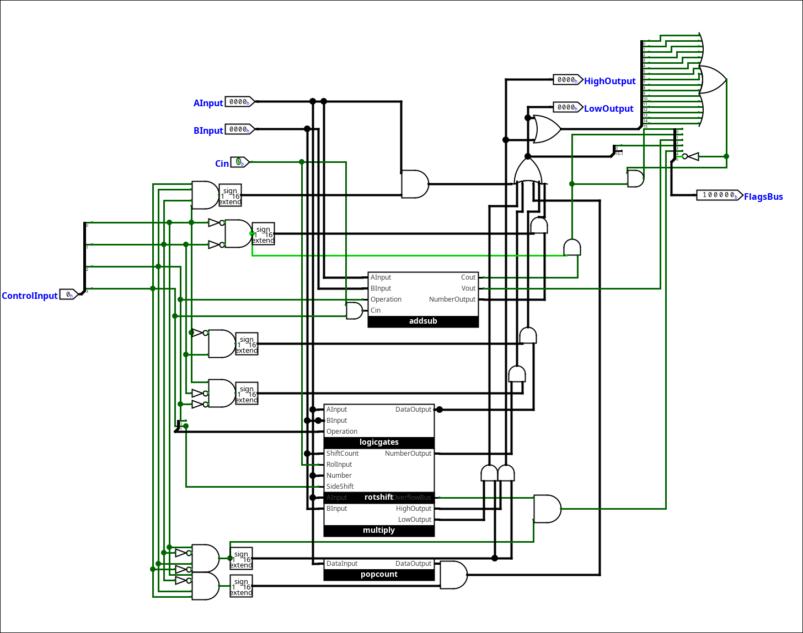

#### `ALU` (top-level)
Selects among the functional units based on `ControlInput[4]` (16 possible operations).

Instantiated units:

| Sub-unit | Function |
|---|---|
| `addsub` | Addition and subtraction via CLA |
| `logicgates` | Bitwise operations (AND, OR, XOR, NOT) |
| `rotshift` | Logical and rotate shifts |
| `multiply` | 16×16 → 32-bit multiplication |
| `popcount` | Population count (count of set bits) |

Outputs: `HighOutput[16]`, `LowOutput[16]` (for 32-bit results), `FlagsBus[6]`.

---

#### `addsub`
16-bit add/subtract unit with carry.

- A 16-bit `XOR Gate` inverts `BInput` when `Operation=1` (subtraction via two's complement)
- Instantiates `CLAAdder` for the actual addition
- `Cin` acts as borrow in subtraction mode
- Generates `Cout[1]` and `Vout[1]` (overflow)

<!-- SCREENSHOT: Logisim > AMFB-16.circ > addsub — full circuit view showing the XOR inversion stage feeding into CLAAdder -->
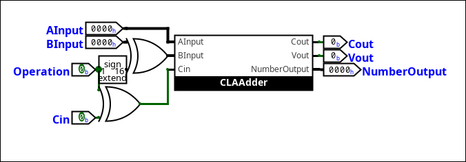

---

#### `CLAAdder` — 16-bit Carry-Lookahead Adder

The main adder, implemented with carry-lookahead logic for fast parallel carry computation.

```
AInput[16] ──┐
             XORAdder ──► partial sum (P bits)
BInput[16] ──┘

              ┌── LAU4 (bits  0– 3) ──► C1
Cin ──────────┤── LAU4 (bits  4– 7) ──► C2
              ├── LAU4 (bits  8–11) ──► C3
              ├── LAU4 (bits 12–15) ──► C4
              └── LAU4 GlobalLAU    ──► Cout, Vout

XORAdder + carries ──► NumberOutput[16]
```

- `XORAdder` computes the propagate bits P = A XOR B for all 16 bits
- 4× local `LAU4` (one per 4-bit group) + 1× global `LAU4`
- 3× `reverse` for bit-order adaptation on internal connections
- Signals: `Cin`, `Cout`, `Vout` (overflow), `NumberOutput[16]`

<!-- SCREENSHOT: Logisim > AMFB-16.circ > CLAAdder — full circuit view showing XORAdder, the 4 local LAU4s, the global LAU4, and the final XORAdder output stage -->
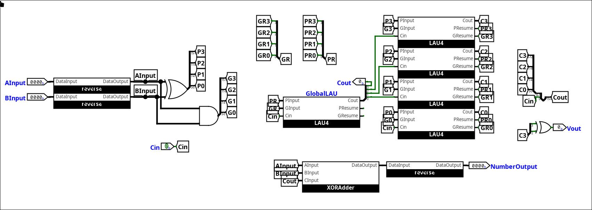

---

#### `LAU4` — 4-bit Look-Ahead Unit

The core building block of the CLA. Computes all 4 output carries in parallel from G (generate) and P (propagate) signals.

- Inputs: `GInput[4]`, `PInput[4]`, `Cin[1]`
- Outputs: `Cout[4]`, `GResume[1]`, `PResume[1]` (fed to the global LAU4)
- Implemented with **14 AND gates** and **5 OR gates**
- All carries are computed purely combinationally with no carry chain

Boolean equations implemented:
```
C1 = G0 + P0·Cin
C2 = G1 + P1·G0 + P1·P0·Cin
C3 = G2 + P2·G1 + P2·P1·G0 + P2·P1·P0·Cin
C4 = G3 + P3·G2 + P3·P2·G1 + P3·P2·P1·G0 + P3·P2·P1·P0·Cin
GResume = G3 + P3·G2 + P3·P2·G1 + P3·P2·P1·G0
PResume = P3·P2·P1·P0
```

<!-- SCREENSHOT: Logisim > AMFB-16.circ > LAU4 — full circuit view showing the AND/OR gate network that computes the 4 carries in parallel -->
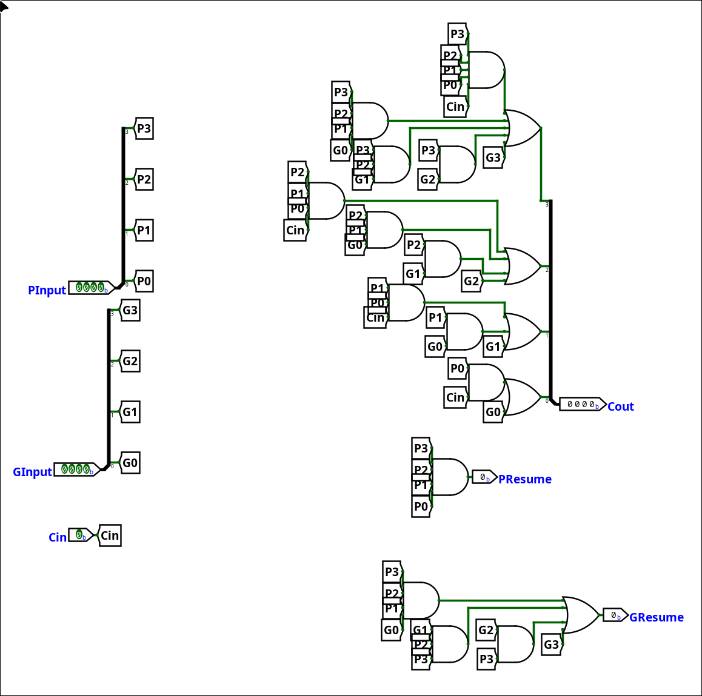

---

#### `XORAdder`
16-bit bitwise XOR sum (no carry propagation), using 16× `mininoCoutAdder`.

Inputs: `AInput[16]`, `BInput[16]`, `CInput[16]` (per-bit external carry). Output: `DataOutput[16]`.

---

#### `mininoCoutAdder`
1-bit adder without carry output: `S = A XOR B XOR Cin`. Two XOR gates.

---

#### `logicgates`
16-bit bitwise logic operations selected by `Operation[2]`:

| Operation | Function |
|---|---|
| `00` | AND |
| `01` | OR |
| `10` | XOR |
| `11` | NOT A |

Implemented with AND, OR, XOR, NOT gates plus Bit Extenders for the selection signal.

<!-- SCREENSHOT: Logisim > AMFB-16.circ > logicgates — full circuit view showing the four operation paths and the output selection logic -->
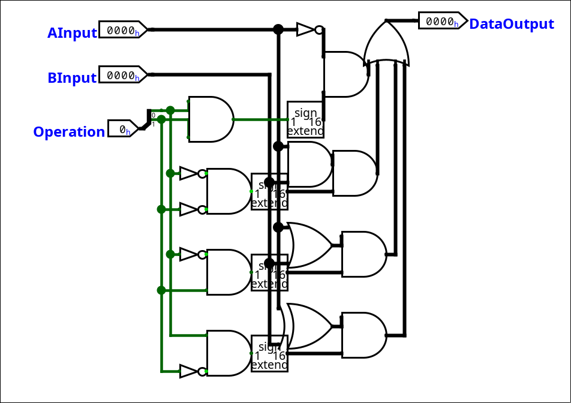

---

#### `rotshift` — Shift and Rotate Unit
Shifts or rotates `Number[16]` by a number of positions given by `ShiftCount[16]`.

- `SideShift[1]`: direction (left / right)
- `RolInput[1]`: rotate mode (ROL/ROR) vs logical shift (SHL/SHR)
- Implemented as a barrel-shifter network in powers of 2:

```
rolshift1 (×1) ──► rolshift2 (×2) ──► rolshift4 (×4) ──► rolshift8 (×8)
```

Each `rolshiftN` applies its shift only if the corresponding bit of `ShiftCount` is set. Two `reverse` blocks support both directions.

<!-- SCREENSHOT: Logisim > AMFB-16.circ > rotshift — full circuit view showing the four-stage barrel shifter chain and the two reverse blocks -->
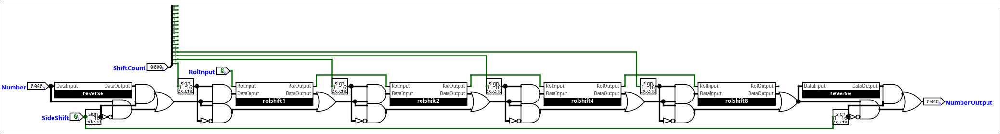

---

#### `rolshift1 / 2 / 4 / 8`
Elementary 1-, 2-, 4- and 8-position shift/rotate sub-circuits.

- `rolshift1`: shifts 1 bit; an `AND Gate` feeds the outgoing bit back as the incoming bit when `RolInput=1` (rotate)
- `rolshift2` instantiates 2× `rolshift1`; `rolshift4` instantiates 2× `rolshift2`; `rolshift8` instantiates 2× `rolshift4`

<!-- SCREENSHOT: Logisim > AMFB-16.circ > rolshift1 — circuit view showing the single-bit shift and the AND-gate rotate feedback path -->
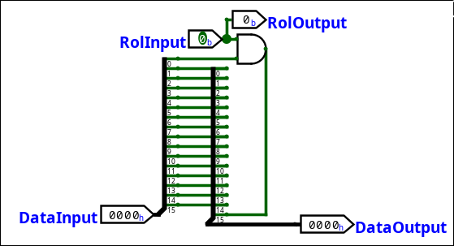

---

#### `multiply` — 16×16 Multiplier
Implements multiplication via shifted partial products (shift-and-add algorithm).

```
For each bit i of BInput (i = 0..15):
  Partial_i = AInput AND BInput[i]   (AND Gate + Bit Extender)
  Partial_i <<= i                     (shift1/2/4/8 cascade)
  Partial_i → shorttoint (16→32 bits)

Sum of 16 partials via tree of 15× megaadder
Result: HighOutput[16] (bits 31–16) + LowOutput[16] (bits 15–0)
```

The `megaadder` tree sums the 16 32-bit partial products in stages. A final OR of all overflow bits produces `OverflowBus`.

<!-- SCREENSHOT: Logisim > AMFB-16.circ > multiply — full circuit view showing the 16 AND+shift lanes and the megaadder reduction tree -->
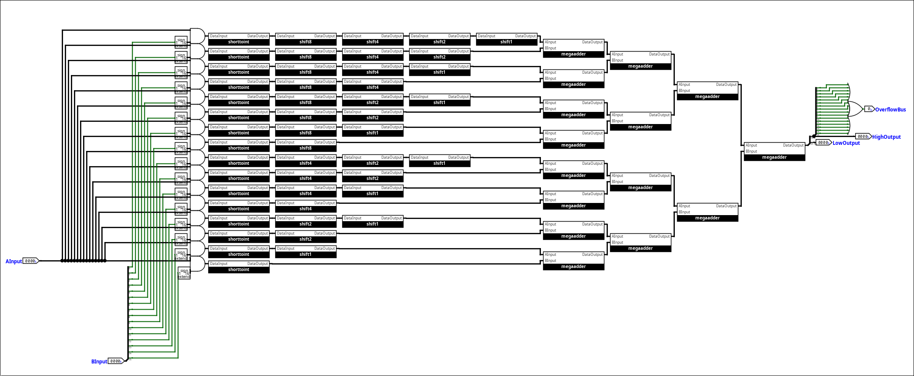

---

#### `megaadder`
32-bit adder: splits into two 16-bit halves and uses 2× `CLAAdder`.

<!-- SCREENSHOT: Logisim > AMFB-16.circ > megaadder — circuit view showing the two CLAAdder instances wired for 32-bit addition -->
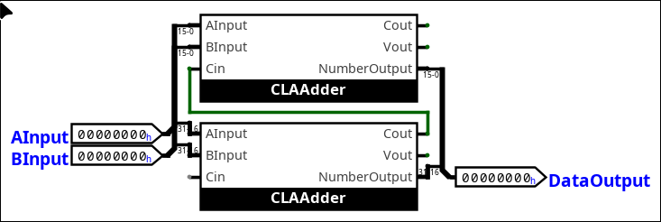

---

#### `shift1 / 2 / 4 / 8`
32-bit non-rotating shifters used by the multiplier.

- `shift1`: shifts 1 position (Splitter + Constant 0 fill)
- `shift2`: 2× `shift1`
- `shift4`: 2× `shift2`
- `shift8`: 2× `shift4`

<!-- SCREENSHOT: Logisim > AMFB-16.circ > shift1 — circuit view showing the splitter and zero-fill for a 1-position 32-bit left shift -->
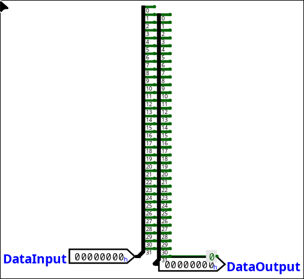

---

#### `shorttoint`
Zero-extends a 16-bit value to 32 bits by filling the upper 16 bits with zeros (16× `Constant 0` + Splitter).

---

#### `popcount` — Population Count
Counts the number of set bits in `DataInput[16]`. Result in `DataOutput[16]`.

Implemented as an adder tree:
```
16 bits → 8× minihalfadder   (1-bit pairs   → 2-bit counts)
        → 4× popcountadder0  (2-bit pairs   → 3-bit counts)
        → 2× popcountadder1  (3-bit pairs   → 4-bit counts)
        → 1× halfbyteadder   (4-bit pairs   → 5-bit count)
→ final result (max value 16 = 0b10000, fits in 5 bits)
```

<!-- SCREENSHOT: Logisim > AMFB-16.circ > popcount — full circuit view showing the four-level adder tree from the 16 input bits down to the 5-bit output -->
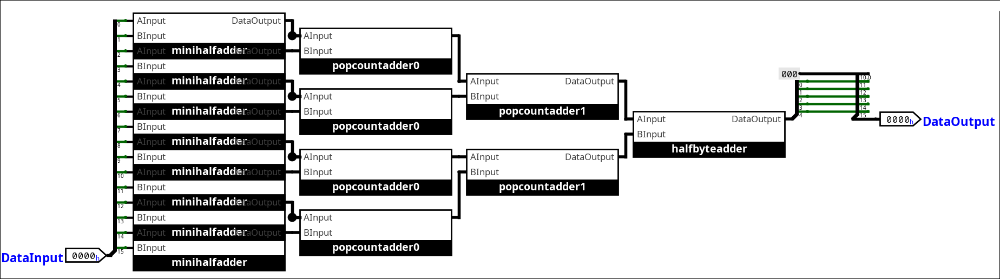

---

#### Popcount auxiliary adders

| Circuit | Inputs | Output | Function |
|---|---|---|---|
| `minihalfadder` | A[1], B[1] | [2] | Half-adder: 1+1 → 2-bit sum |
| `minihalfadder2output` | A[1], B[1] | High[1], Low[1] | Same but with separate output pins |
| `miniadder` | A[1], B[1], Cin[1] | High[1], Low[1] | Full 1-bit adder |
| `popcountadder0` | A[2], B[2] | [3] | Adds two 2-bit popcount values |
| `popcountadder1` | A[3], B[3] | [4] | Adds two 3-bit popcount values |
| `halfbyteadder` | A[4], B[4] | [5] | Adds two nibbles → 5-bit result |

<!-- SCREENSHOT: Logisim > AMFB-16.circ > minihalfadder — circuit view (small, just XOR + AND) -->
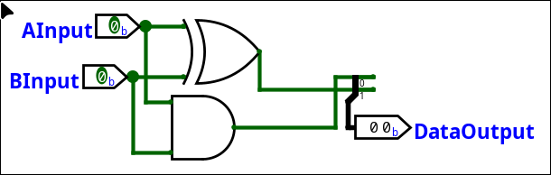

---

#### `reverse`
Reverses the bit order of a 16-bit word. Uses two `Splitter` components in opposite orientations. No active logic.

---

#### `big2little`
Extracts the low 16 bits from a 32-bit bus. Two `Splitter` components.

---

### `GMFB.circ` — GPU and Complete System

#### `GPU`
Graphics unit integrated into the system.

- **GCPU**: dedicated GPU processor (full CPU-like core with its own `Gdecoder`, `GALU`, `IOregisters`)
- **Dedicated ROM**: 16-bit address, 64-bit instruction words (GPU program)
- **Video RAM (DualRAM)**: 12-bit address (4 096 pixels), 16-bit RGB data per pixel
- A **12-bit Counter** scans VRAM addresses for display refresh (max `0xFFF`)
- A **12-bit Adder** combines the base address with a pixel offset
- A **12-bit Splitter** extracts the X[6] and Y[6] screen coordinates from the scan counter
- System outputs: `RGB[16]`, `X[6]`, `Y[6]`, `GPUData[16]`
- System inputs: `CPUInput[16]`, `GPUWE[1]` (write enable from CPU), `CPUAddress[3]` (I/O register selector), `Keyboard[7]`

<!-- SCREENSHOT: Logisim > GMFB.circ > GPU — full circuit view showing the GCPU block, ROM, VRAM, scan counter, and X/Y splitter -->
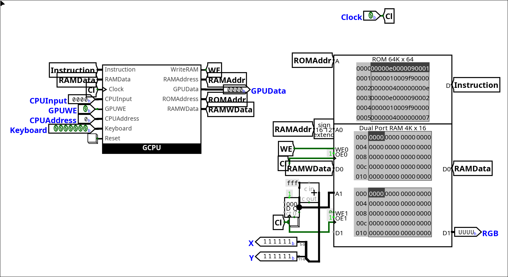

---

#### `GCPU` — GPU's internal CPU
A variant of the main CPU adapted for graphics processing.

- Instantiates `Gdecoder`, `IOregisters`, and `GALU`
- A **Counter** acts as the GPU's program counter
- 3× `Multiplexer` for data path selection
- Bus signals shared with the main system via tunnels

<!-- SCREENSHOT: Logisim > GMFB.circ > GCPU — full circuit view showing the three sub-blocks and the counter-based PC -->
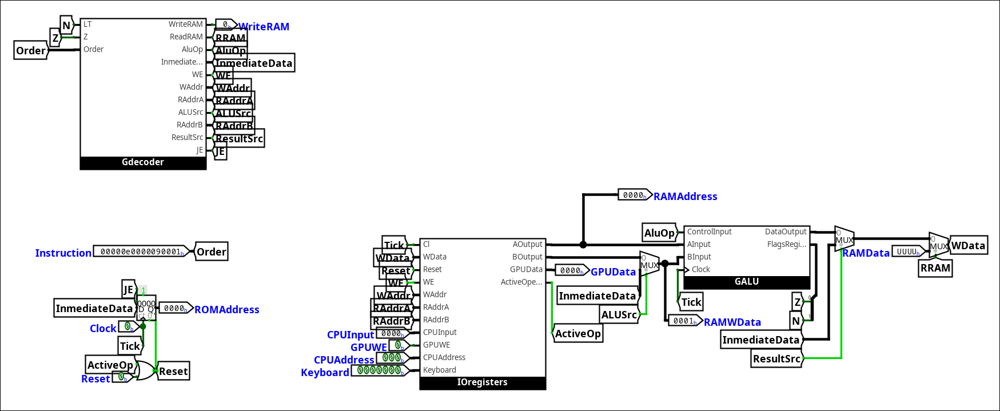

---

#### `Gdecoder`
GPU instruction decoder. Structurally identical to the main CPU's `decode`:
- Same 64-bit instruction format (identical 64→6 group splitter)
- Same control signals: `WE`, `ALUSrc`, `ResultSrc`, `WriteRAM`, `AluOp`, `LT`, `Z`, `JE`
- 28 debug LEDs

<!-- SCREENSHOT: Logisim > GMFB.circ > Gdecoder — full circuit view (should look nearly identical to the CPU decode circuit) -->
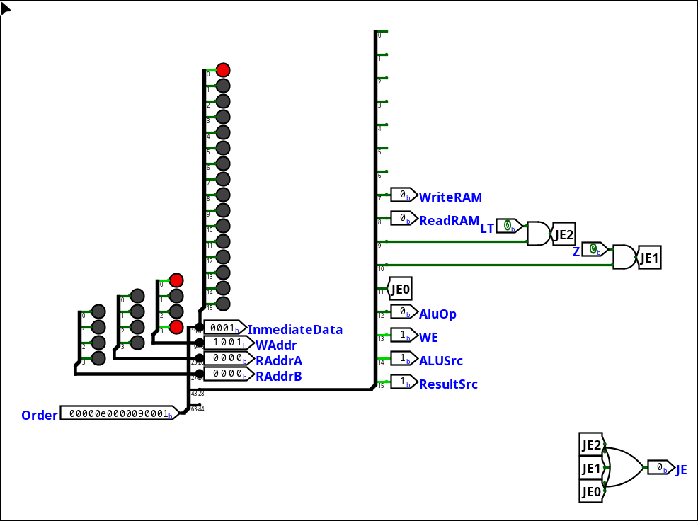

---

#### `GALU` — GPU ALU
Simplified ALU for graphics operations (basic arithmetic for the graphics pipeline).

- Inputs: `AInput[16]`, `BInput[16]`, `ControlInput[1]`, `Clock[1]`, `FlagsRegister[2]`
- Uses Logisim's native `Adder`, `Subtractor`, and `Comparator` components
- A `Register` latches flags across cycles
- A `Multiplexer` selects the operation based on `ControlInput`
- Output: `DataOutput[16]`

<!-- SCREENSHOT: Logisim > GMFB.circ > GALU — full circuit view showing the Adder/Subtractor/Comparator and the output multiplexer -->
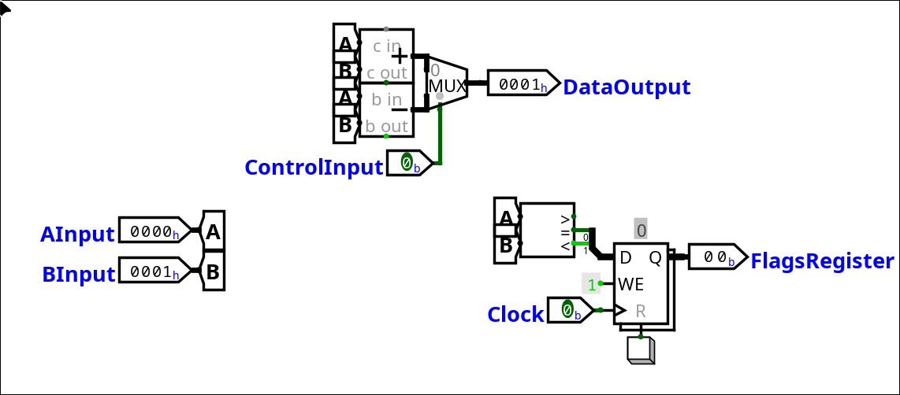

---

#### `IOregisters` — Register File with I/O
**16-register file, 16 bits each** (17 in total) with I/O support.

- Same architecture as the CPU's `registers` block
- One additional **7-bit register** stores the keyboard state (`Keyboard[7]`)
- Special ports: `GPUWE`, `CPUAddress[3]`, `CPUInput[16]` allow the main CPU to write into GPU registers
- `ActiveOperation[1]`: signals whether the GPU is currently performing an operation
- A `Bit Extender` widens the 7-bit keyboard value to 16 bits for the internal bus
- `NOR Gate` + `OR Gate` implement the I/O write-enable logic

<!-- SCREENSHOT: Logisim > GMFB.circ > IOregisters — full circuit view highlighting the register array, the 7-bit keyboard register, and the CPU write-port logic -->
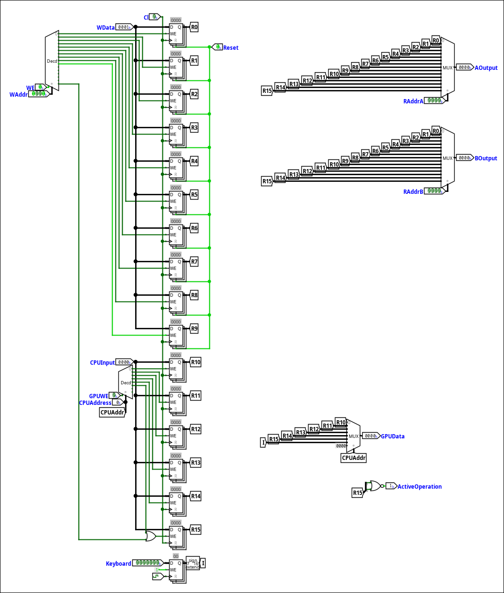

---

#### `test`
GPU test bench. Instantiates `GPU`, `RGB Video`, `Clock`, constants, and buttons to simulate the complete display environment.

<!-- SCREENSHOT: Logisim > GMFB.circ > test — full circuit view showing the GPU wired to RGB Video with buttons and clock -->
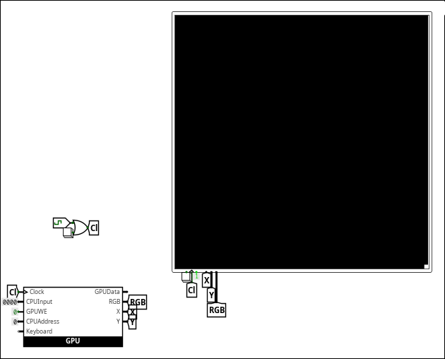

---

## Component Hierarchy

```
FullComputer
└── Computer
    ├── ROM (16-addr, 64-data)          ← main program memory
    ├── DualRAM (16-addr, 16-data)      ← data memory
    ├── CPU
    │   ├── programCounter              ← 16× minihalfadder + Register
    │   ├── registers                   ← 16× 16-bit Register
    │   ├── decode                      ← combinational, 64-bit → control signals
    │   └── adaptedALU
    │       └── ALU
    │           ├── addsub
    │           │   └── CLAAdder        ← 16-bit CLA
    │           │       ├── XORAdder    ← 16× mininoCoutAdder
    │           │       └── 5× LAU4     ← 4-bit look-ahead units
    │           ├── logicgates          ← AND/OR/XOR/NOT 16-bit
    │           ├── rotshift            ← ROL/ROR/SHL/SHR
    │           │   └── rolshift1/2/4/8
    │           ├── multiply            ← shift-and-add 16×16→32
    │           │   ├── 15× megaadder
    │           │   │   └── 2× CLAAdder
    │           │   └── shift1/2/4/8 (32-bit)
    │           └── popcount            ← adder tree
    │               ├── 8× minihalfadder
    │               ├── 4× popcountadder0
    │               ├── 2× popcountadder1
    │               └── halfbyteadder
    └── GPU
        ├── ROM (16-addr, 64-data)      ← GPU program memory
        ├── DualRAM (12-addr, 16-data)  ← VRAM (4096 px, RGB16)
        ├── Counter 12-bit              ← display scan counter
        └── GCPU
            ├── Gdecoder
            ├── GALU                    ← Adder/Subtractor/Comparator
            └── IOregisters             ← 16× Register + Keyboard[7]
```

---

## Technical Specifications

| Parameter | Value |
|---|---|
| Data width | 16 bits |
| Instruction width | 64 bits |
| ROM / RAM address space | 2¹⁶ = 65 536 words |
| General-purpose registers | 16 × 16-bit |
| ALU operations | ≥ 16 (4-bit `ControlInput`) |
| Multiplier | 16×16 → 32-bit |
| Adder | 16-bit CLA (4× LAU4 groups + 1 global LAU4) |
| VRAM | 4 096 words × 16-bit (12-bit address) |
| Display resolution | 64×64 pixels (X[6] × Y[6]) |
| Color depth | 16-bit RGB per pixel |
| Keyboard | 7-bit input |
| Simulator | Logisim Evolution |

---
